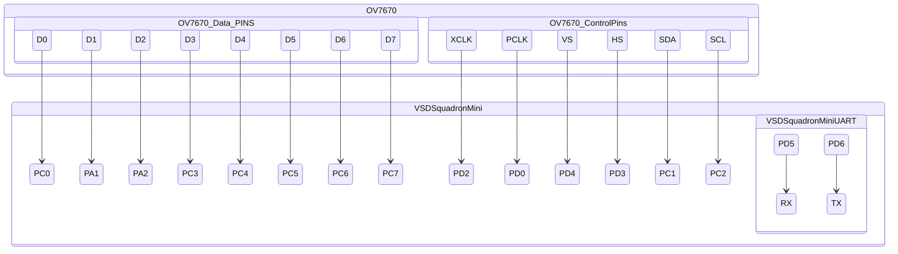

# Live OV7670  implementation on VSD Squadron mini
*will work on any Ch32v003F4 based board*

updated version of [https://github.com/dhanvantibhavsar/RiscV/tree/main/BitNetMCU/VsdSquadron/Arduino_Ov7670](https://github.com/dhanvantibhavsar/RiscV/tree/main/BitNetMCU/VsdSquadron/Arduino_Ov7670)

