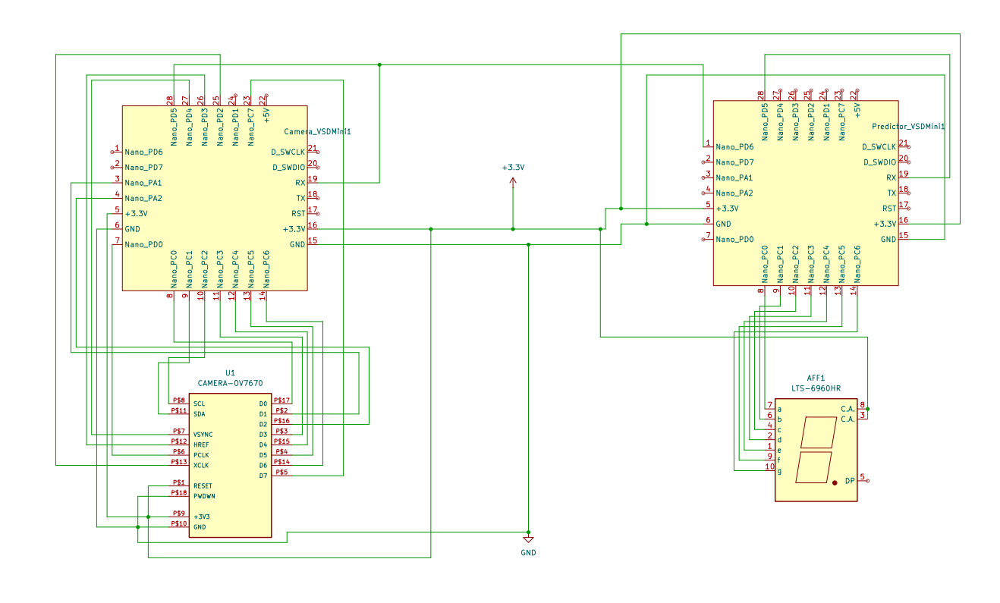

# Quantized AI Model
- Exhibited at :- Semicon 2024 under VSD (VLSI System Design)
- Presended By :- VLSI System Design
- Duration :- 11 Sep to 13 Sep
- Based on :- Real Time Implementation of Low-Bit Quntized Neural network on Risc-V microcontroller

## Main Features 
- Demonstrates Neural network on Risc-V microcontroller
- Interfaced  camera with CH32V003F4U6 based microcontroller
- Demonstrates on edge AI capabilities of Risc-V microcontroller
- Complete demonstration implemented on VSD Squadron Mini based on Risc-V microcobtroller

## Demo Video 
[]

## Social Media link
[]

[]

**Please Check underlying Readme.md files for further details of every task**

## Flow of the QUantized AI Model
1. [Training](./Training/)
2. [Camera Interfacing](./VSD_Camera_Interfacing/)
3. [Prediction](./VSD_Prediction/)

## Circuit diagram
- 

