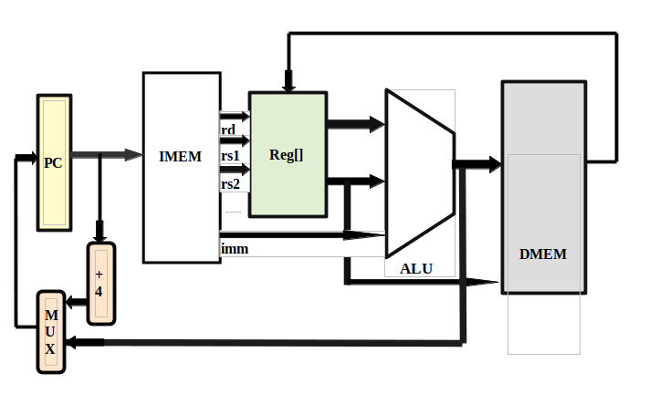
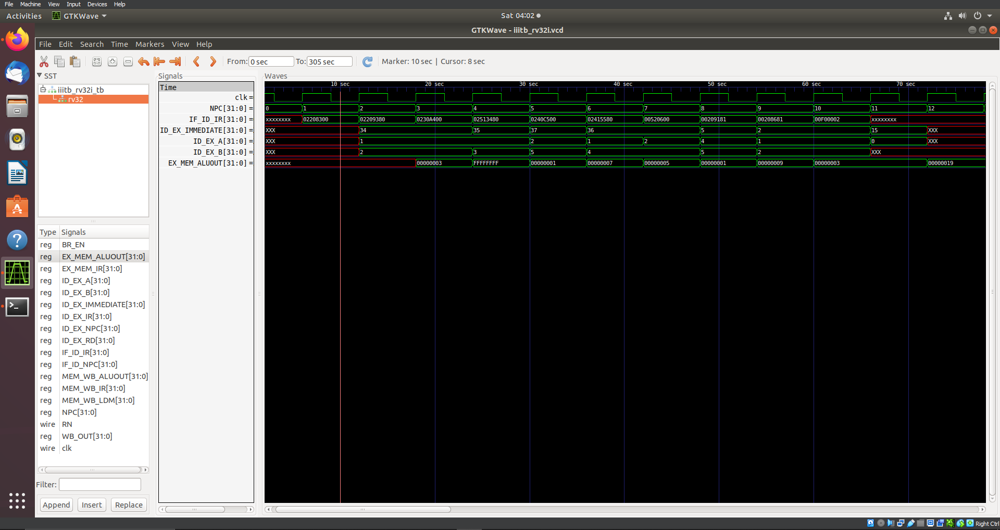
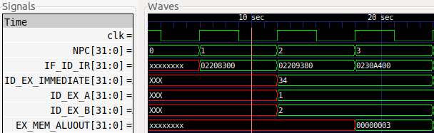
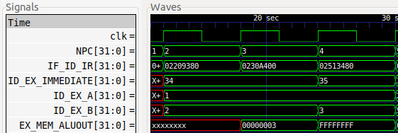
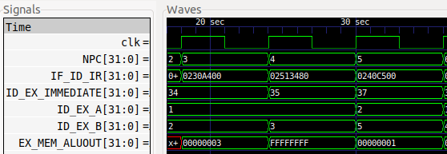
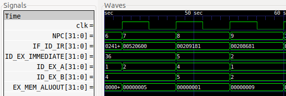
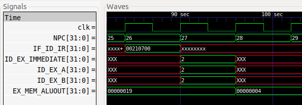

# Task III
## Executing RV32I on verilog and verfying execution
### Understanding RV32I
- RV32I is a basic implementation of RISC-V architecture to test and implement its implementation

- Following is a block diagram of RV32I architecture

#### Understanding Architecture
- PC - Program counter 
    - Register to track which task is being executed
    - Signal - **NPC**

- IMEM - Memory stack which stores program codes, and process 32 bit commands
    - Outputs 
        - rs1 - register to be selected for rs1(*as per command 32bit command)
        - rs2 - register  to be selected for rs2(*as per command 32bit command)
        - rd - register  to be selected for rd(*as per command 32bit command)
        - imm - Immediate input to be provided from the command
    - Signals - 
        - outputs - 
            - rs1 - IF_ID_IR[19:15] -ID_EX_A
            - rs2 - IF_ID_IR[24:20] -ID_EX_B
            - rd - IF_ID_IR[11:7] - ID_EX_RD


- REG[] - Register stack which stores Register data,
    - defined by I_DECODE STAGE in iiitb_rv32i.v code 
    ```
    always @(posedge clk) begin
    ID_EX_A <= REG[IF_ID_IR[19:15]];
    ID_EX_B <= REG[IF_ID_IR[24:20]];
    ID_EX_RD <= REG[IF_ID_IR[11:7]];
    ID_EX_IR <= IF_ID_IR;
    ID_EX_IMMEDIATE <= {{20{IF_ID_IR[31]}},IF_ID_IR[31:20]};
    ID_EX_NPC<=IF_ID_NPC;
    end
    ```

- ALU  - The main Processing Part of the architecture
    - Defined in Execution Stage

    ```
    //EXECUTION STAGE

    always@(posedge clk) begin

    EX_MEM_IR <=  ID_EX_IR;
    //EX_MEM_COND <= (ID_EX_IR[6:0] == BR_TYPE) ? 1'd1 :1'd0;


    case(ID_EX_IR[6:0])

    AR_TYPE:begin
        if(ID_EX_IR[31:25]== 7'd1)begin
        case(ID_EX_IR[14:12])

        ADD:EX_MEM_ALUOUT <= ID_EX_A + ID_EX_B;
        SUB:EX_MEM_ALUOUT <= ID_EX_A - ID_EX_B;
        AND:EX_MEM_ALUOUT <= ID_EX_A & ID_EX_B;
        OR :EX_MEM_ALUOUT <= ID_EX_A | ID_EX_B;
        XOR:EX_MEM_ALUOUT <= ID_EX_A ^ ID_EX_B;
        SLT:EX_MEM_ALUOUT <= (ID_EX_A < ID_EX_B) ? 32'd1 : 32'd0;

        endcase
        end
        else begin
            case(ID_EX_IR[14:12])
            ADDI:EX_MEM_ALUOUT <= ID_EX_A + ID_EX_IMMEDIATE;
            SUBI:EX_MEM_ALUOUT <= ID_EX_A - ID_EX_IMMEDIATE;
            ANDI:EX_MEM_ALUOUT <= ID_EX_A & ID_EX_B;
            ORI:EX_MEM_ALUOUT  <= ID_EX_A | ID_EX_B;
            XORI:EX_MEM_ALUOUT <= ID_EX_A ^ ID_EX_B;
            endcase
        end

    end

    M_TYPE:begin
        case(ID_EX_IR[14:12])
        LW  :EX_MEM_ALUOUT <= ID_EX_A + ID_EX_IMMEDIATE;
        SW  :EX_MEM_ALUOUT <= ID_EX_IR[24:20] + ID_EX_IR[19:15];
        endcase
    end

    BR_TYPE:begin
        case(ID_EX_IR[14:12])
        BEQ:begin 
        EX_MEM_ALUOUT <= ID_EX_NPC+ID_EX_IMMEDIATE;
        BR_EN <= 1'd1 ? (ID_EX_IR[19:15] == ID_EX_IR[11:7]) : 1'd0;
        //BR_PC = EX_MEM_COND ? EX_MEM_ALUOUT : 1'd0; 
    end
    BNE:begin 
        EX_MEM_ALUOUT <= ID_EX_NPC+ID_EX_IMMEDIATE;
        BR_EN <= (ID_EX_IR[19:15] != ID_EX_IR[11:7]) ? 1'd1 : 1'd0;
    end
    endcase
    end

    SH_TYPE:begin
    case(ID_EX_IR[14:12])
    SLL:EX_MEM_ALUOUT <= ID_EX_A << ID_EX_B;
    SRL:EX_MEM_ALUOUT <= ID_EX_A >> ID_EX_B;
    endcase
    end

    endcase
    end


    //EXECUTION STAGE END

    ```

    - Signal
        - Output - EX_MEM_ALUOUT


### Execution 
-  Installation  steps
```
$   sudo apt get update
$   sudo apt get install iverilog gtkwave
```

- Execution commands
```
$ iverilog -o iiitb_rv32i rv32i/iiitb_rv32i.v rv32i/iiitb_rv32i_tb.v
$ ./iiitb_rv32i
```

- Output View Generation \
Output file name can be changed by updating dumpfile in iiitb_rv32i_tb.v
    - Command\
    `$ gtkwave iiitb_rv32i.vcd`

### Code to be executed
- Commands can be updated in rv32i/iiitb_rv32i.v   by storing 32bit hex codes
as generated in Task2 in IMEM stack program memory

```
always @(posedge RN) begin
    //NPC<= 32'd0;
MEM[0] <= 32'h02208300;         // add r6,r1,r2.(i1)
MEM[1] <= 32'h02209380;         //sub r7,r1,r2.(i2)
MEM[2] <= 32'h0230a400;         //and r8,r1,r3.(i3)
MEM[3] <= 32'h02513480;         //or r9,r2,r5.(i4)
MEM[4] <= 32'h0240c500;         //xor r10,r1,r4.(i5)
MEM[5] <= 32'h02415580;         //slt r11,r2,r4.(i6)
MEM[6] <= 32'h00520600;         //addi r12,r4,5.(i7)
MEM[7] <= 32'h00209181;         //sw r3,r1,2.(i8)
MEM[8] <= 32'h00208681;         //lw r13,r1,2.(i9)
MEM[9] <= 32'h00f00002;         //beq r0,r0,15.(i10)
MEM[25] <= 32'h00210700;         //add r14,r2,r2.(i11)
end
```


### GTKWave Verification
Once GTKWave signal viewer opens, continue with following steps
1. Select rv32 SST
2. Insert the signals from left bottom column to main window by selecting and pressing Insert button, or by dragging and dropping
3. Select preferred data formats by right clicking 
- Check the following image of output waves view


#### Testing command execution
1. Addition Command
    - Command -  add r6,r1,r2
    - 32 hex bit code -  02208300

    | NPC | IF_ID_IR | ID_EX_A | ID_EX_B | EX_MEM_ALUOUT |
    | --- | -------- | ------- | ------- | ------------- |
    | 0   |xxxxxxxxxx| XXX     | XXX     |  xxxxxxxxxxxx |
    | 1   | 02208300 | XXX     | XXX     |  xxxxxxxxxxxx |
    | 2   | Next Command | 1     | 2     |  xxxxxxxxxxxx |
    | 3   | Next Command | rs1 val for Next Command| rs2 val for Next Command     |  00000003 |

    

    #### Inference
    1. For 0 NPC value i.e  first step of execution; PC is updated and value of PC is provided to IMEM
    2. For 1 NPC value i.e  second step of execution; IMEM outputs the command as output value and provides it to REG to get data from register Stack
    3. For 2 NPC value i.e  third step of execution; REG outputs values for rs1 and rs2 
        - rs1 = ID_EX_A = 1
        - rs2 = ID_EX_B = 2
    4. For 3 NPC value i.e  fourth step of execution; ALU calculates the output based on command inputs. 
        - EX_MEM_ALUOUT= 1+2 = 00000001+ 00000010 = 00000011 = 3

2. Substraction Command
    - Command -  sub r7,r1,r2
    - 32 hex bit code -  02209380

    | NPC | IF_ID_IR | ID_EX_A | ID_EX_B | EX_MEM_ALUOUT |
    | --- | -------- | ------- | ------- | ------------- |
    | 1   |xxxxxxxxxx| XXX     | XXX     |  xxxxxxxxxxxx |
    | 2   | 02209380 | XXX     | XXX     |  xxxxxxxxxxxx |
    | 3   | Next Command | 1     | 2     |  xxxxxxxxxxxx |
    | 4   | Next Command | rs1 val for Next Command| rs2 val for Next Command     |  FFFFFFFF |

    

    #### Inference
    1. For 1 NPC value i.e  first step of execution; PC is updated and value of PC is provided to IMEM
    2. For 2 NPC value i.e  second step of execution; IMEM outputs the command as output value and provides it to REG to get data from register Stack
    3. For 3 NPC value i.e  third step of execution; REG outputs values for rs1 and rs2 
        - rs1 = ID_EX_A = 1
        - rs2 = ID_EX_B = 2
    4. For 4 NPC value i.e  fourth step of execution; ALU calculates the output based on command inputs. 
        - EX_MEM_ALUOUT= 1-2= 00000001-00000002 = FFFFFFFF = -1

3. And Command
    - Command -  and r8,r1,r3
    - 32 hex bit code -  0230a400

    | NPC | IF_ID_IR | ID_EX_A | ID_EX_B | EX_MEM_ALUOUT |
    | --- | -------- | ------- | ------- | ------------- |
    | 2   |xxxxxxxxxx| XXX     | XXX     |  xxxxxxxxxxxx |
    | 3   | 0230a400 | XXX     | XXX     |  xxxxxxxxxxxx |
    | 4   | Next Command | 1     | 3     |  xxxxxxxxxxxx |
    | 5   | Next Command | rs1 val for Next Command| rs2 val for Next Command     | 00000001 |

    

    #### Inference
    1. For 2 NPC value i.e  first step of execution; PC is updated and value of PC is provided to IMEM
    2. For 3 NPC value i.e  second step of execution; IMEM outputs the command as output value and provides it to REG to get data from register Stack
    3. For 4 NPC value i.e  third step of execution; REG outputs values for rs1 and rs2 
        - rs1 = ID_EX_A = 1
        - rs2 = ID_EX_B = 3
    4. For 5 NPC value i.e  fourth step of execution; ALU calculates the output based on command inputs. 
        - EX_MEM_ALUOUT= 00000001 AND  00000003 = 00000001 =1

4. Or Command
    - Command -  or r9,r2,r5
    - 32 hex bit code -  02513480

    | NPC | IF_ID_IR | ID_EX_A | ID_EX_B | EX_MEM_ALUOUT |
    | --- | -------- | ------- | ------- | ------------- |
    | 3   |xxxxxxxxxx| XXX     | XXX     |  xxxxxxxxxxxx |
    | 4   | 02513480 | XXX     | XXX     |  xxxxxxxxxxxx |
    | 5   | Next Command | 2     | 5     |  xxxxxxxxxxxx |
    | 6   | Next Command | rs1 val for Next Command| rs2 val for Next Command     | 00000007 |

    

    #### Inference
    1. For 3 NPC value i.e  first step of execution; PC is updated and value of PC is provided to IMEM
    2. For 4 NPC value i.e  second step of execution; IMEM outputs the command as output value and provides it to REG to get data from register Stack
    3. For 5 NPC value i.e  third step of execution; REG outputs values for rs1 and rs2 
        - rs1 = ID_EX_A = 2
        - rs2 = ID_EX_B = 5
    4. For 6 NPC value i.e  fourth step of execution; ALU calculates the output based on command inputs. 
        - EX_MEM_ALUOUT= 00000002 OR  0000003 = 00000007 =7


7. Addition Immidiate Command
    - Command -  addi r12,r4,5
    - 32 hex bit code -  00520600

    | NPC | IF_ID_IR | ID_EX_A | ID_EX_B | ID_EX_IMMEDIATE | EX_MEM_ALUOUT |
    | --- | -------- | ------- | ------- |---| ------------- |
    | 6   |xxxxxxxxxx| XXX     | XXX     | xxxxxx |  xxxxxx |
    | 7   | 00520600 | XXX     | XXX     | xxxxxx | xxxxx |
    | 8   | Next Command | 4   | XXX   |5|  xxxxxxxx |
    | 9   | Next Command | rs1 val for Next Command| rs2 val for Next Command     | 0000009 |

    

    #### Inference
    1. For 6 NPC value i.e  first step of execution; PC is updated and value of PC is provided to IMEM
    2. For 7 NPC value i.e  second step of execution; IMEM outputs the command as output value and provides it to REG to get data from register Stack
    3. For 8 NPC value i.e  third step of execution; REG outputs values for rs1 and immediate value
        - rs1 = ID_EX_A = 4
        - imm = ID_EX_IMMEDIATE = 5
    4. For 9 NPC value i.e  fourth step of execution; ALU calculates the output based on command inputs. 
        - EX_MEM_ALUOUT= 4 + 5=  00000004 OR  00000005 = 00000009 =9

10. Add Command at MEM25
    - Command -  add r14,r2,r2
    - 32 hex bit code -  00210700

    | NPC | IF_ID_IR | ID_EX_A | ID_EX_B | EX_MEM_ALUOUT |
    | --- | -------- | ------- | ------- | ------------- |
    | 25   |xxxxxxxxxx| XXX     | XXX     |  xxxxxxxxxxxx |
    | 26   | 00210700 | XXX     | XXX     |  xxxxxxxxxxxx |
    | 27   | Next Command | 2     | 2    |  xxxxxxxxxxxx |
    | 28   | Next Command | rs1 val for Next Command| rs2 val for Next Command     | 00000004 |

    

    #### Inference
    1. For 25 NPC value i.e  first step of execution; PC is updated and value of PC is provided to IMEM
    2. For 26 NPC value i.e  second step of execution; IMEM outputs the command as output value and provides it to REG to get data from register Stack
    3. For 27 NPC value i.e  third step of execution; REG outputs values for rs1 and rs2 
        - rs1 = ID_EX_A = 2
        - rs2 = ID_EX_B = 2
    4. For 28 NPC value i.e  fourth step of execution; ALU calculates the output based on command inputs. 
        - EX_MEM_ALUOUT= 00000002 OR  0000002 = 00000004 4


