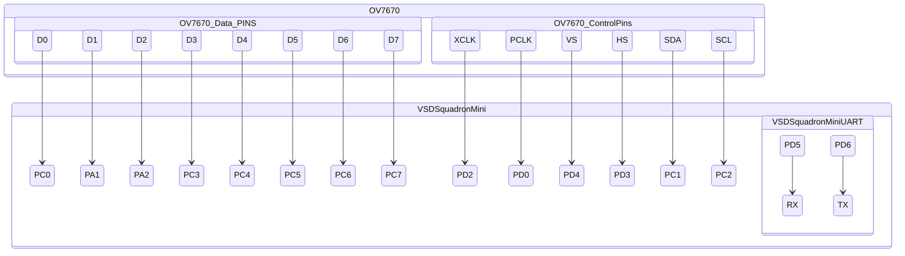
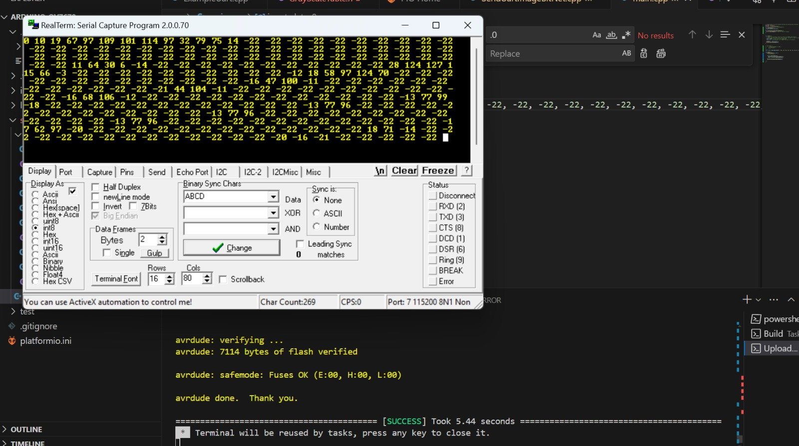

# Live OV7670  implementation on VSD Squadron mini
*will work on any Ch32v003F4 based board*

### VSD Squadron mini and Ov7670 implementation
- **Please note This implementation has been forked and edited to support VSDSquadron Real Time implementation from [LiveOV7670](https://github.com/indrekluuk/LiveOV7670)**

#### Installation
1. Install Arduino IDE 1.8 (please use version less than 2.0.0)
2. Download ArduImageCapture from [Built ArduImageCapture](https://circuitjournal.com/download?file=ArduImageCapture.1.1.zip) or build it from repo [ArduImageCapture Github repo](https://github.com/indrekluuk/ArduImageCapture)
3. paste extracted or built folder in `Documents > Arduino> tools` folder
4. Restart Arduino IDE 
5. Install [RealTerm: Serial/TCP Terminal ](https://sourceforge.net/projects/realterm/)

#### Camera Capture and Testing
1. Initialize PlatformIO project in [VSD_Camera_Interfacing](./) folder
2. Comment line no 10 and Uncomment line no. 11 in [SendUartImageBitNet.cpp](./src/SendUartImageBitNet.cpp) file and define DisplayMode = 0 \
this will send image in 112x 112 size to be displayed on ArduImageCapture
3. Select Correct Port to which the board is connected
4. Build and upload the code to VSD Squadron Mini board
5. Open Arduino IDE then select `tool> ArduImageCapture`
6. Select correct port and click on listen
    - You should be able to visualize the captured image on the ArduImageCapture
7. Adjust camera so that proper text Image is captured 

#### Image Capturing, Comperssion and sending over Uart
- Once image Capture is in place we can change to sending data to VSDSquadronMini over UART for prediction
1.  Comment line no 11 and Uncomment line no. 10 in [SendUartImageBitNet.cpp](./src/SendUartImageBitNet.cpp) file and define DisplayMode = 1 \
this will send image in 28x28 to be used for prediction
2. Select Correct Port to which the board is connected
3. Build and upload the code to VSD Squadron Mini Board
4. Push Button to capture and send image Data
5. Verify Data being Sent over UART using RealTerm 

