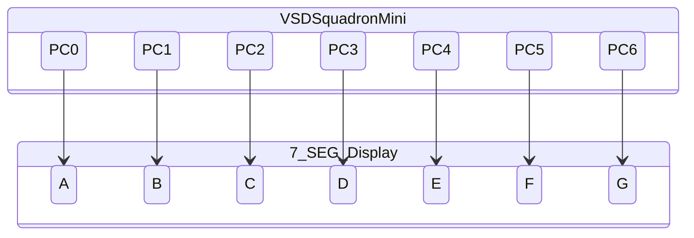
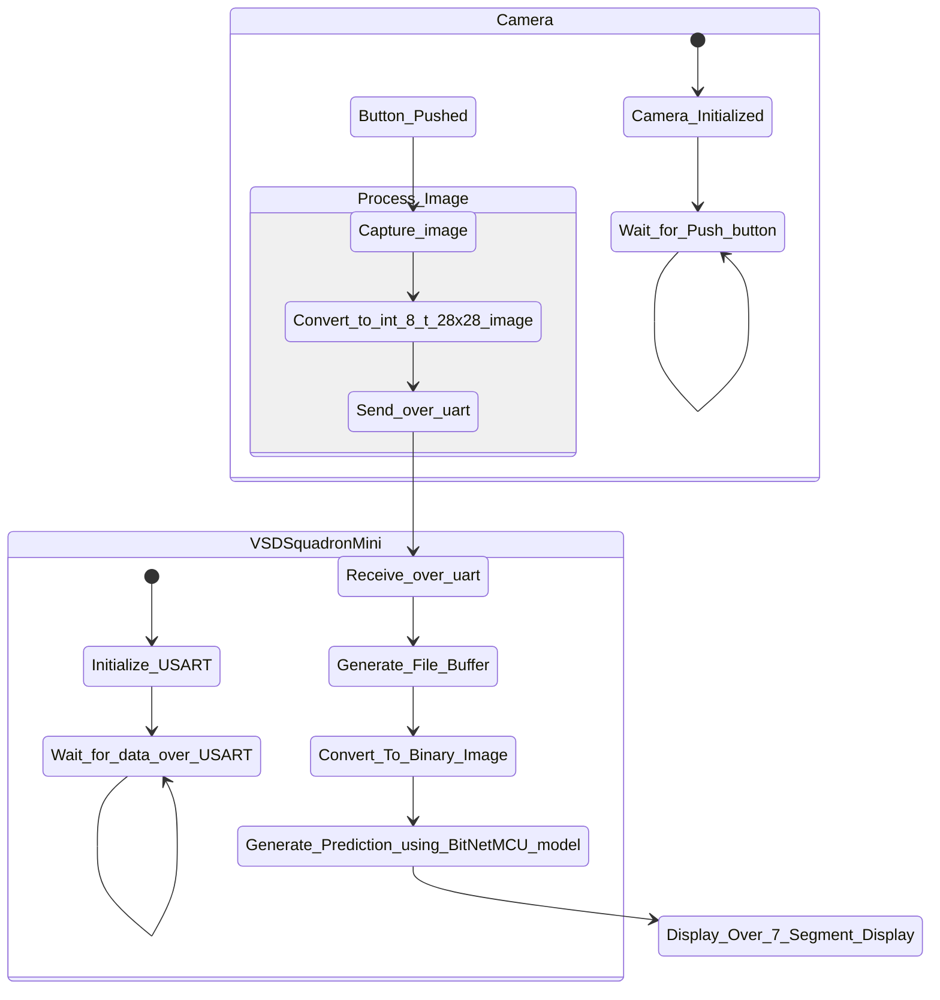

# Uploading Quantized AI trained model to VSDSquadron and Realtime implementation

## Overview
- After generation and testing of BitNetMCU Model in C, we upload the model to Low cost, Low Bit Risc-V Microcontroller
- Microcontroller - CH32V003F4U6
- Platform - VSD Squadron Mini
- Architecture - RISC-V 

## Toolchain Installation
1. Install VSCode
2. Install PlatformIo extension

3. Add VSD Squadron Mini to platformIO Platforms by adding following link `https://github.com/Community-PIO-CH32V/platform-ch32v` and press install
 

## Demo implementation with test images stored on board while flashing

### Implementation
1. Initialize PlatformIO project in [VSD Prediction](./VSD_Prediction/) folder
2. Comment line no 15 and Uncomment line no. 16 in [main.c](./src/main.c) file and define Demo=1 \
this will put the code to process data using demo mode
3. Update generated model in data folder and change model file to be loaded accordingly
4. Select Correct Port to which the board is connected
5. Build and upload the code to VSDSquadronMini
6. Connect 7 segment display as follows

### Result
- You should be able to see Image recognised image prediction being displayed on the 7 Segment Display
- A Repeating pattern of 7 - 1 - 9 - 4 should be displayed on  7 Segment Display
-  \
**Please not that the segment A of 7 Segment Display was blown out while testing**

## Real Time Implementation with USART communication with Arduino and OV7670 integration

### State Diagram

### Connection Diagram

- Connect Circuits according to above circuit diagram

### VSDImplementation
1. Initialize PlatformIO project in [VSD Prediction](./) folder
2. Comment line no 16 and Uncomment line no. 15 in [main.c](./src/main.c) file and define Demo=0 \
this will put the code to process data being sent over UART and generate prediction using live images
3. Update generated model in data folder and change model file to be loaded accordingly
4. Select Correct Port to which the board is connected
5. Build and upload the code to VSDSquadronMini
6. Press Push button and data Prediction should be updated on the 7 Segment Display

