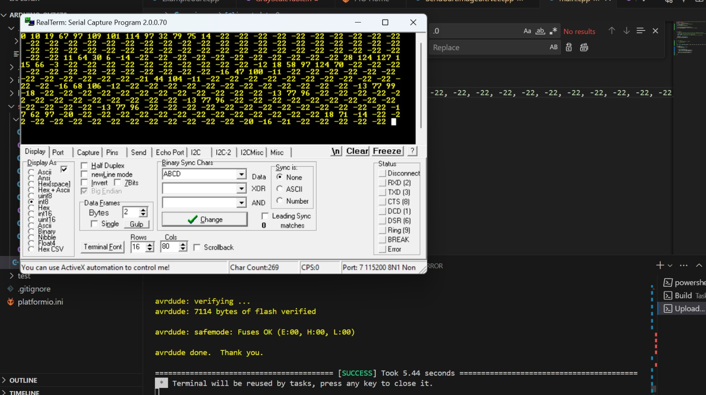

# Uploading Quantized AI trained model to VSDSquadron and Realtime implementation

## Content 
1. [Overview](#overview)
2. [ToolChain Installation](#toolchain-installation)
3. [Demo implementation with test images stored on board while flashing](#demo-implementation-with-test-images-stored-on-board-while-flashing)
    1. [Implementation](#implementation)
    2. [Result](#result)
4. [Real Time Implementation with USART communication with VSD Squadron mini and OV7670 integration](#real-time-implementation-with-usart-communication-with-arduino-and-ov7670-integration)
    1. [State Diagram](#state-diagram)
    2. [Connection Diagram](#connection-diagram)
    3. [Installation](#installation)
    4. [Camera Capture and Testing](#camera-capture-and-testing)
    5. [Image Capturing, Comperssion and sending over Uart](#image-capturing-comperssion-and-sending-over-uart)
    6. [VSDImplementation](#vsdimplementation)
## Overview
- After generation and testing of BitNetMCU Model in C, we upload the model to Low cost, Low Bit Risc-V Microcontroller
- Microcontroller - CH32V003F4U6
- Platform - VSD Squadron Mini
- Architecture - RISC-V 

## Toolchain Installation
1. Install VSCode
2. Install PlatformIo extension

3. Add VSD Squadron Mini to platformIO Platforms by adding following link `https://github.com/Community-PIO-CH32V/platform-ch32v` and press install
 

## Demo implementation with test images stored on board while flashing

### Implementation
1. Initialize PlatformIO project in [VSD Prediction](./VSD_Prediction/) folder
2. Comment line no 15 and Uncomment line no. 16 in [main.c](./src/main.c) file and define Demo=1 \
this will put the code to process data using demo mode
3. Update generated model in data folder and change model file to be loaded accordingly
4. Select Correct Port to which the board is connected
5. Build and upload the code to VSDSquadronMini
6. Connect 7 segment display as follows

### Result
- You should be able to see Image recognised image prediction being displayed on the 7 Segment Display
- A Repeating pattern of 7 - 1 - 9 - 4 should be displayed on  7 Segment Display
-  \
**Please not that the segment A of 7 Segment Display was blown out while testing**

## Real Time Implementation with USART communication with Arduino and OV7670 integration

### State Diagram

### Connection Diagram

- Connect Circuits according to above circuit diagram

### Arduino and Ov7670 implementation
- **Please note This implementation has been forked and edited to support VSDSquadron Real Time implementation from [LiveOV7670](https://github.com/indrekluuk/LiveOV7670)**

#### Installation
1. Install Arduino IDE 1.8 (please use version less than 2.0.0)
2. Download ArduImageCapture from [Built ArduImageCapture](https://circuitjournal.com/download?file=ArduImageCapture.1.1.zip) or build it from repo [ArduImageCapture Github repo](https://github.com/indrekluuk/ArduImageCapture)
3. paste extracted or built folder in `Documents > Arduino> tools` folder
4. Restart Arduino IDE 
5. Install [RealTerm: Serial/TCP Terminal ](https://sourceforge.net/projects/realterm/)

#### Camera Capture and Testing
1. Initialize PlatformIO project in [Arduino_Ov7670](./Arduino_Ov7670/) folder
2. Comment line no 10 and Uncomment line no. 11 in [SendUartImageBitNet.cpp](./Arduino_Ov7670/src/LiveOV7670/SendUartImageBitNet.cpp) file and define DisplayMode = 0 \
this will send image in 112x 112 size to be displayed on ArduImageCapture
3. Select Correct Port to which the board is connected
4. Build and upload the code to Arduino
5. Open Arduino IDE then select `tool> ArduImageCapture`
6. Select correct port and click on listen
    - You should be able to visualize the captured image on the ArduImageCapture
7. Adjust camera so that proper text Image is captured 

#### Image Capturing, Comperssion and sending over Uart
- Once image Capture is in place we can change to sending data to VSDSquadronMini over UART for prediction
1.  Comment line no 11 and Uncomment line no. 10 in [SendUartImageBitNet.cpp](./Arduino_Ov7670/src/LiveOV7670/SendUartImageBitNet.cpp) file and define DisplayMode = 1 \
this will send image in 16x16 to be used for prediction
2. Select Correct Port to which the board is connected
3. Build and upload the code to Arduino
4. Push Button to capture and send image Data
5. Verify Data being Sent over UART using RealTerm 

### VSDImplementation
1. Initialize PlatformIO project in [Bitnetmcu_implementation](./) folder
2. Comment line no 16 and Uncomment line no. 15 in [main.c](./src/main.c) file and define Demo=0 \
this will put the code to process data being sent over UART and generate prediction using live images
3. Update generated model in data folder and change model file to be loaded accordingly
4. Select Correct Port to which the board is connected
5. Build and upload the code to VSDSquadronMini
6. Press Push button and data Prediction should be updated on the 7 Segment Display

